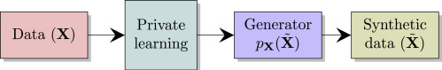
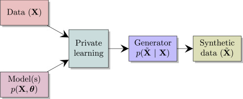

> This paper is an open access article distributed under the terms of the [Creative Commons CC-BY](http://creativecommons.org/licenses/by/4.0/) license.

[ScienceDirect](https://www.sciencedirect.com/science/article/pii/S2666389921000970)
[Patterns](https://www.cell.com/patterns/fulltext/S2666-3899(21)00097-0)

As pointed out by [Non-interactive differential privacy: a survey](obsidian://open?vault=Privacy&file=Non-Interactive%20Differential%20Privacy.%20a%20Survey), we have two approaches: *add noise* and *synthetic microdata*. The first one can only be used in certain situations, therefore, authors want to improve the performance of synthetic microdata. To achieve this goal, they use prior knowledge to enhance models, which introduce the posterior predictive distribution into the generate phase.

![[Pasted image 20221023154704.png]]

## Workflow   
The following figure is the traditional way to generate synthetic data. In this process, the private learning phase only relies on the data themselves. However, the learning process on a dataset is disordered, which means the model may spend lots of time on learning, and even learn some wrong patterns or patterns with bias or discrimination. 

To resolve (or we should say, reduce this issue), the authors of this paper proposed another input source, the prior knowledge. Engineers could build a model to describe a Bayesian network.

## The accuracy and performance

In the next chapter, the authors also discuss the radio of results that reproductions maintain the statistical discoveries and all reproductions. However, the results vary widely between different groups in same privacy protection strength. The reason is that some statistical features are not significant in some groups, therefore, if we set a same level of privacy protection, those features will be hidden.

